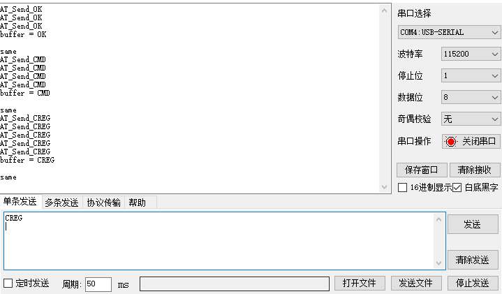
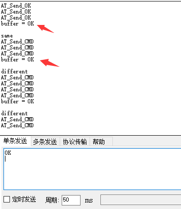

## 串口数据发送与解析

### 1.1 malloc() 函数

malloc() 是一个C语言中的动态内存分配函数，其函数原型为： **void *malloc(unsigned int size)** 

1.  因为malloc() 函数返回的是不确定类型的指针，因此返回之前必须经过强制类型转换；
2.  malloc() 函数只管分配内存，并不会初始化，因此要配合memset() 函数使用；
3.  参数为需要分配的字节大小，如果malloc(1)，就是分配了一个字节大小；如果malloc(sizeof(int))，就是分配了一个int变量所占的字节大小；
4.  分配的空间不在使用时，要用free() 函数释放；

#### malloc() 使用示例

``` c
int *p;
p = (int *)malloc( sizeof(int) * 100 );		//分配了100个int类型的空间
free(p);
```

### 1.2 字符串拼接

串口接收数据一般是一个字节一个字节的接收，如单片机AT指令给模块发送命令后，模块会返回一个字符串作为响应。如发送 "AT\r\n" 会返回"\r\nOK\r\n" ，对于单片机来说，接收到的数据就应该是buf[0] = '\r'，buf[1] = '\n'，buf[2] = 'O'，buf[3] = 'K'，buf[4] = '\r'，buf[5] = '\n' ；我们需要将单个字符拼接成一个字符串，来与我们预期的字符串相比较。从而判断发送的命令是否有效，如果有效则发送下一条命令；无效则重复发送这条命令，直至有效为止。

#### 1.2.1 sprintf() 函数

sprintf() 函数是一个字符串格式化命令，函数原型为：**int sprintf(char *string, char *format [,argument,...])** ，主要功能就是把格式化的数据写入到某个字符串中，**可以实现字符串的拼接；字符转换为字符串的功能。**

- string ：是一个指向字符数组的指针（目标），用于存储字符串；
- format：这是字符或字符串（源），格式化参数；

#### 1.2.2 strcat() 函数

strcat() 函数就是将一个字符串追加到另一个字符串的结尾，实现字符串的拼接功能，函数原型为：**char *strcat(char *strDest, const char *strScr)**  将stcScr中的数据追加输入到strDest中。

#### 使用示例

``` c
uint8_t data = 'a';
uint8_t tmpData[2];
uint8_t * buffer = (uint8_t*)malloc(50);

sprintf(tmpData,"%c",data);		//字符转换成字符串
strcat(buffer,tmpData);			//字符串拼接到buffer中
```

### 1.3 串口数据的发送

串口数据的发送可以参考**AT指令发送程序**，通过回调函数实现了不同状态下调用不同的函数，即根据模块返回的AT参数的不同，来发送不同的AT指令。

### 1.4 串口数据的接收

串口接收的数据一般是不定长的，为串口接收到的数据**添加帧头和帧尾**，并用顺序队列来接收数据，将一帧数据拼接成一个字符串，与预期字符串相比，即可判断模块工作状态。

#### 1.4.1 顺序队列

``` c
#include <stdio.h>
#include <string.h>
#include <stdbool.h>
#include <malloc.h>

#define QUEUE_DATA_MAX 50

typedef struct _SqQueue
{
    uint8_t queueTail;                     /* 队列尾，入队时需要自加 */
    uint8_t queueHead;                     /* 队列头，出队时需要自减 */
    uint8_t queueLength;                   /* 保存的是当前队列有效数据的长度 */
    uint8_t queueBuf[QUEUE_DATA_MAX];      /* 数据缓冲区 */
}SqQueue;

static SqQueue uartQueue;

/***************************************************************************
*	函 数 名: Uart_RecvQueue_Init
*	功能说明: 串口接收队列初始化
*	形    参: 无
*	返 回 值: 无
****************************************************************************/
void Uart_RecvQueue_Init(void)
{
    uartQueue.queueHead = 0;
    uartQueue.queueTail = 0;
    uartQueue.queueLength = 0;
    memset(uartQueue.queueBuf, 0, sizeof(uartQueue.queueBuf));
}

/***************************************************************************
*	函 数 名: Uart_RecvQueue_Read
*	功能说明: 读队列数据
*	形    参: *data: 数据指针
*	返 回 值: bool:队列为空返回false,否则返回true
****************************************************************************/
bool Uart_RecvQueue_Read(uint8_t *data)
{
    if(uartQueue.queueLength == 0){
        return false;
    }
    *data = uartQueue.queueBuf[uartQueue.queueHead];
    uartQueue.queueBuf[uartQueue.queueHead] = 0;
    uartQueue.queueHead ++;
    uartQueue.queueHead %= QUEUE_DATA_MAX;  /* 防止数组溢出 */
    uartQueue.queueLength --;

    return true;
}

/***************************************************************************
*	函 数 名: Uart_RecvQueue_Write
*	功能说明: 写队列数据
*	形    参: data: 数据
*	返 回 值: bool:队列已满返回false,否则返回true
****************************************************************************/
bool Uart_RecvQueue_Write(uint8_t data)
{
    if(uartQueue.queueLength >= QUEUE_DATA_MAX)
    {
        return false;
    }
    uartQueue.queueBuf[uartQueue.queueTail] = data;
    uartQueue.queueTail ++;
    uartQueue.queueTail %= QUEUE_DATA_MAX; /* 防止数组溢出 */
    uartQueue.queueLength ++;
    return true;
}

/***************************************************************************
*	函 数 名: Get_RecvQueue_Len
*	功能说明: 写队列数据
*	形    参: data: 数据
*	返 回 值: uint8_t:返回队列中数据长度
****************************************************************************/
uint8_t Get_RecvQueue_Len(void)
{
    return uartQueue.queueLength;
}
```

#### 1.4.2 字符串接收拼接示例

``` c
int main() 
{
   Uart_RecvQueue_Write('a') ;
   Uart_RecvQueue_Write('b') ;
   Uart_RecvQueue_Write('c') ;
   uint8_t * buffer = (uint8_t*)malloc(50);
   memset(buffer,0,50);
   uint8_t data;
   uint8_t tmp[2];
   while(1)
   {
       if(Uart_RecvQueue_Read(&data))
       {
           printf("-------------\r\n");

           sprintf(tmp,"%c",data);
           strcat(buffer,tmp);

           printf("data = %c\n",data);
           printf("buffer = %s\n",buffer);
       }
       else
           break;
   }
    printf( "buffer =? abc  %d\r\n",strcmp(buffer,"abc"));	//strcmp 返回0，表示字符串相等，否则返回-1
}
```

#### 1.4.3 串口数据断帧

串口在接收数据时，数据长度一般是不固定的，但是我们需要一帧一帧的对数据进行处理。因此我们应该接收一帧数据，处理一帧数据，而不是将数据全部接收过来并处理。

##### 1、添加帧头和帧尾

为每一帧数据添加一个帧头和帧尾，即"帧头" + "数据" + "帧尾"，处理数据时从帧头开始将数据拼接，拼接到帧尾结束，这样就得到了一帧完整数据。

##### 2、使用串口帧空闲中断

使能串口帧空闲中断，当接收一帧数据后，串口会产生一次中断，根据是否产生中断来判断是否接收一串完整的数据。

##### 3、根据接收到的字符之间的间隔进行判断

串口数传输都是使用标准波特率，因此串口传输一帧数据时，字符与字符之间的时间间隔是一个固定值，我们可以根据串口的波特率去计算串口每个字符的间隔时间，**在数据接收的过程中判断接收的两个字节之间间隔大于3.5个字符间隔时间，则认为当前数据帧传输完毕。**

#### 1.4.4 串口AT指令发送、接收解析程序

AT指令发送程序负责将指令字符串发送给串口，根据索引值Index 发送不同的指令；串口接收解析程序负责将数据接收，拼接成一个字符串，并将该字符串与预期数据比较，如果数据相同，则修改索引值，使发送程序发送下一条指令；如果数据不同，则索引值保持不变，使发送程序继续发送当前指令。所有指令发送完成后，停止发送指令。**下面的测试程序运行在ESP32单片机上。**下图是运行效果，串口调试助手模拟AT模块，通过串口调试助手发送 **"OK\r\n"** ，单片机逐个字符的接收数据  **'O'、'K'、'\r'、'\n'**  然后将其拼接成字符串 **"OK\r\n"** ，再与设定好的字符串进行比较，如果相同，则修改状态机索引at_index，使其发送下一条命令，即 **AT_Send_CMD** 。同理，通过串口调试助手发送 **"CMD\r\n"** 命令后会跳转，发送下一条命令。如果字符串不匹配，则重复发送本条命令，如下图所示：

 